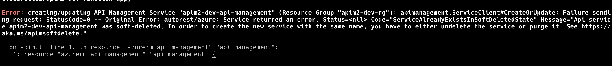

# Table of Contents

- [Table of Contents](#table-of-contents)
  - [Introduction](#introduction)
  - [Prerequisites](#prerequisites)
  - [Infrastructure deployment](#infrastructure-deployment)
  - [Post deployment Actions](#post-deployment-actions)
    - [Test the Azure Function](#test-the-azure-function)
    - [Deploy the Azure Function](#deploy-the-azure-function)
    - [Grant admin consent](#grant-admin-consent)
    - [Start the WebApp](#start-the-webapp)
  - [AAD vs. Managed Identity](#aad-vs-managed-identity)
  - [Troubleshooting](#troubleshooting)

## Introduction

This repository demonstrates an end-to-end deployment of an Azure Active Directory (AAD) authenticated call to an Azure Function (AF) behind API Management (API-M).  The infrastructure is deployed using terraform and the user then starts a WebApp, logs in to AAD, then calls the underlying Azure Function through API-M.

## Prerequisites

- [Terraform](https://learn.hashicorp.com/tutorials/terraform/install-cli?in=terraform/aws-get-started)
- [AZ CLI](https://docs.microsoft.com/en-us/cli/azure/install-azure-cli)
- [Azure Functions core tools](https://docs.microsoft.com/en-us/azure/azure-functions/functions-run-local?tabs=v3%2Cmacos%2Ccsharp%2Cportal%2Cbash%2Ckeda#v2)

## Infrastructure deployment

Create a `terraform.tfvars` file: `touch deployment/terraform/terraform.tfvars` with the following content:

```text
project = "apim2"
environment = "dev"
location = "eastus2"
```

Note that you may (likely will) need to change the `project = apim2` to some other value as it will need to be globally unique.

Then execute the following commands:

```text
cd deployment/terraform
terraform init
terraform plan --var-file terraform.tfvars
terraform apply --auto-approve --var-file terraform.tfvars
```

Deploying API-M can take anywhere from 40 minutes to up to 1h 40m, so execute the apply, make sure there are no errors (like global naming issues), and go grab some coffee as it may take some time.

## Post deployment Actions

### Test the Azure Function

You can test the function with the following command:

```text
cd functions
npm i
npm start
```

Open your browser to [http://localhost:7071/api/hello-world?name=John] and you should see:

```json
{
  "name": "John"
}
```

### Deploy the Azure Function

- `cd` to the  the `<repo>/functions` directory
- Run: `npm run build`
- Run: `func azure functionapp publish apim-dev-function-app --javascript`.  Note that you'd need to change `apim` and `dev` to the `project` and `environment` set in the [terraform.tfvars](deployment/terraform/terraform.tfvars)

### Grant admin consent

- Go to the terraform directory to extract output `cd deployment/terraform` to prepare for the below command.
- Run `az ad app permission admin-consent --id "$(tf output | grep ad_client_app_app_id | awk '{print $3}')"` where the `--id` is the `client-app` client id.  Alternatively see the [admin consent docs](https://docs.microsoft.com/en-us/azure/active-directory/manage-apps/grant-admin-consent) for granting through the [Azure Portal](https://azure.portal.com)

### Start the WebApp

The WebApp is forked and modified from the [Azure Samples 'ms-identity-javascript-react-tutorial'](https://github.com/Azure-Samples/ms-identity-javascript-react-tutorial) project.

First you'll need to update the WebApp [config.json](./ms-identity-javascript-react-spa/src/config.json) before starting the webapp.

<!-- tf output | grep api_management_gateway_url | awk '{print $3}' -->

- Copy the [config.example.json](./ms-identity-javascript-react-spa/src/config.example.json) to [config.json](./ms-identity-javascript-react-spa/src/config.json): `cp ms-identity-javascript-react-spa/src/config.example.json ms-identity-javascript-react-spa/src/config.json`
- Go to the terraform directory to extract output `cd deployment/terraform` to prepare for the below command.
- Copy and paste the following command into your terminal to update the [config.json](./ms-identity-javascript-react-spa/src/config.json):

```text
CLIENT_ID=$(tf output | grep ad_client_app_app_id | awk '{print $3}') \
AUTHORITY="https://login.microsoftonline.com/$(az account show | jq -r '.tenantId')" \
SCOPES="api://$(terraform output | grep ad_backend_app_display_name | awk '{print $3}')/hello_world" \
FUNCTION_HELLO_WORLD="$(terraform output | grep api_management_gateway_url | awk '{print $3}')/hello-world" \
JSON_CONTENTS=$(jq --arg CLIENT_ID $CLIENT_ID --arg AUTHORITY $AUTHORITY --arg SCOPES $SCOPES --arg FUNCTION_HELLO_WORLD $FUNCTION_HELLO_WORLD '.clientId = $CLIENT_ID | .authority = $AUTHORITY | .scopes = [ $SCOPES ] | .functionHelloWorld = $FUNCTION_HELLO_WORLD' ../../ms-identity-javascript-react-spa/src/config.json) \
echo $JSON_CONTENTS > ../../ms-identity-javascript-react-spa/src/config.json
```

- Change directory to the webapp: `cd ../../ms-identity-javascript-react-spa`
- Verify values have been correctly set in [src/config.json](./ms-identity-javascript-react-spa/src/config.json)
- Install node modules: `npm i`
- Start the Webapp: `npm run start`

Navigate to [http://localhost:3000]


Click sign in in the upper right.


Then you should see a Welcome message and a Button to `Call API Management`.


Click the `Call API Management` and you should receive a json response and then see the Bearer token.


The Bearer token is shown here if you want to use [jwt.io](https://jwt.io) or [jwt.ms](https://jwt.ms) to analyze the access token, or if you want to be able to copy and paste it to Test the Azure Function within the API Management interface.

## AAD vs. Managed Identity

The current design has the API-M validating the access token and passing that token to the Azure Function.  The consequence of this is that it would not work in a multi-tenant scenario.  For multi-tenant scenarios it's best to use [Managed Identity](https://docs.microsoft.com/en-us/azure/api-management/api-management-howto-use-managed-service-identity) between the API-M API and the underlying Azure Function, that way the Azure Function only accepts auth from API-M and the API-M can then accept any configured client auth.  Whether this is desirable or not completely depends on the scenario in question.

## Troubleshooting

It will be fairly common to have naming conflicts here as names for certain services are globally unique.  For example you will likely need to rename the API-M name via the [terraform.tfvars](deployment/terraform/terraform.tfvars)
if you see something like this:

