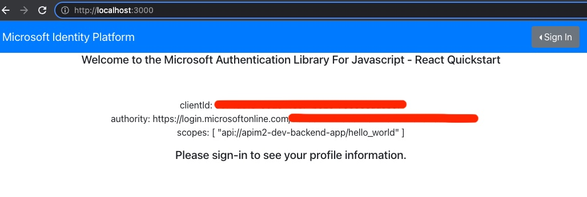
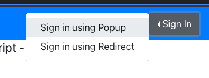
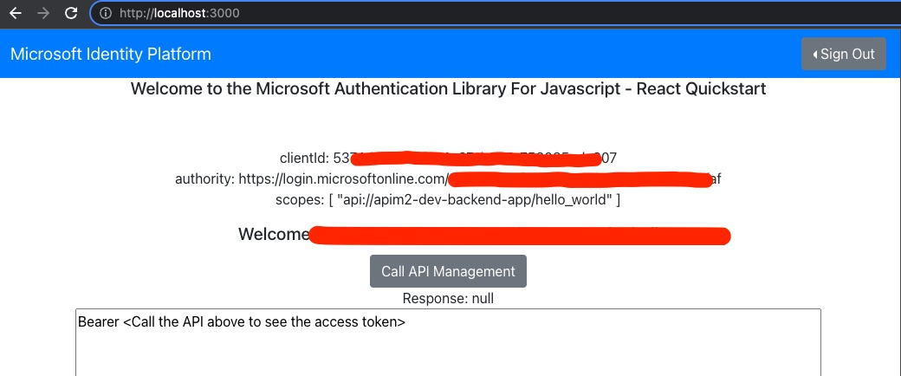
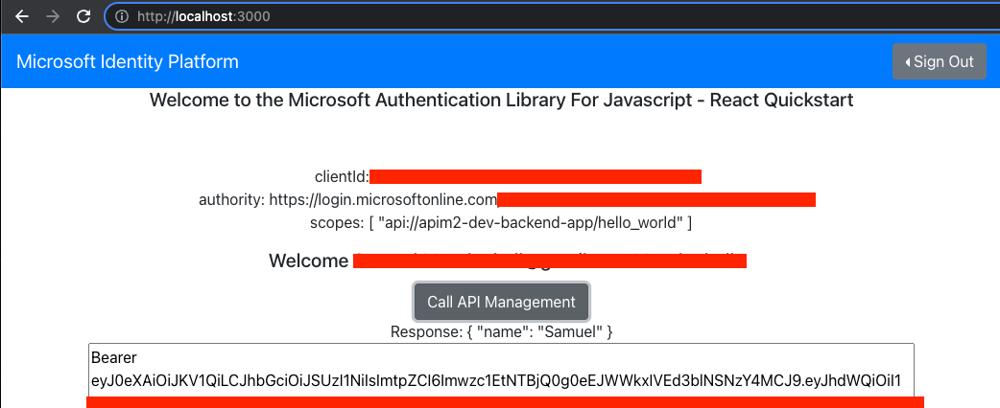

# Table of Contents

- [Table of Contents](#table-of-contents)
  - [Introduction](#introduction)
  - [Prerequisites](#prerequisites)
  - [Infrastructure deployment](#infrastructure-deployment)
  - [Test the Azure Function](#test-the-azure-function)
  - [Deploy the Azure Function](#deploy-the-azure-function)
  - [Start the WebApp](#start-the-webapp)

## Introduction

This repository demonstrates an end-to-end deployment of an Azure Active Directory (AAD) authenticated call to an Azure Function (AF) behind API Management (APIM).  The infrastructure is deployed using terraform and the user then starts a WebApp, logs in to AAD, then calls the underlying Azure Function through APIM.

## Prerequisites

- [Terraform](https://learn.hashicorp.com/tutorials/terraform/install-cli?in=terraform/aws-get-started)
- [AZ CLI](https://docs.microsoft.com/en-us/cli/azure/install-azure-cli)
- [Azure Functions core tools](https://docs.microsoft.com/en-us/azure/azure-functions/functions-run-local?tabs=v3%2Cmacos%2Ccsharp%2Cportal%2Cbash%2Ckeda#v2)

## Infrastructure deployment

Create a `terraform.tfvars` file: `touch deployment/terraform/terraform.tfvars` with the following content:

```text
project = "apim2"
environment = "dev"
location = "eastus2"
```

Note that you may (likely will) need to change the `project = apim2` to some other value as it will need to be globally unique.

Then execute the following commands:

```text
cd deployment/terraform
terraform init
terraform plan --var-file terraform.tfvars
terraform apply --auto-approve --var-file terraform.tfvars
```

Deploying APIM can take anywhere from 40 minutes to up to 1h 40m, so execute the apply, make sure there are no errors (like global naming issues), and go grab some coffee as it may take some time.

There is a [`local-exec` section](deployment/terraform/ad_client.tf) that attempts to automatically grant `admin consent`.  If the `admin consent` fails then you may need to manually execute: `az ad app permission admin-consent --id 00000000-0000-0000-0000-000000000000` where the `0`'s should be replaced with the `client-app` client id.  Alternatively see the [admin consent docs](https://docs.microsoft.com/en-us/azure/active-directory/manage-apps/grant-admin-consent) for granting through the [Azure Portal](https://azure.portal.com)

## Test the Azure Function

You can test the function with the following command:

```text
cd functions
npm i
npm start
```

Open your browser to [http://localhost:7071/api/hello-world?name=John] and you should see:

```json
{
  "name": "John"
}
```

## Deploy the Azure Function

This is *optional* as applying terraform automatically deploys the function as well in a [local-exec](deployment/terraform/function.tf).  If you want to run that manually below is the command.

From the `<repo>/functions` directory execute: `func azure functionapp publish apim2-dev-function-app --javascript`.  Note that you'd need to change `apim2` and `dev` to the `project` and `environment` set in the [terraform.tfvars](deployment/terraform/terraform.tfvars)

## Start the WebApp

The WebApp is forked and modified from the [Azure Samples 'ms-identity-javascript-react-tutorial'](https://github.com/Azure-Samples/ms-identity-javascript-react-tutorial) project.

There is a `local-exec` in [local-exec](deployment/terraform/ad_client.tf) which updates the WebApp's [config.json](ms-identity-javascript-react-spa/src/config.json) with the AAD information from the deployment.  It's recommended to open the [config.json](ms-identity-javascript-react-spa/src/config.json) and verify it's contents have been updated.

Open a terminal to the `<repo>/ms-identity-javascript-react-spa` folder and run `npm run start`.

Navigate to [http://localhost:3000]



Click sign in in the upper right.



Then you should see a Welcome message and a Button to `Call API Management`.



Click the `Call API Management` and you should receive a json response and then see the Bearer token.



The Bearer token is shown here if you want to use [jwt.io](https://jwt.io) or [jwt.ms](https://jwt.ms) to analyze the access token, or if you want to be able to copy and paste it to Test the Azure Function within the API Management interface.
